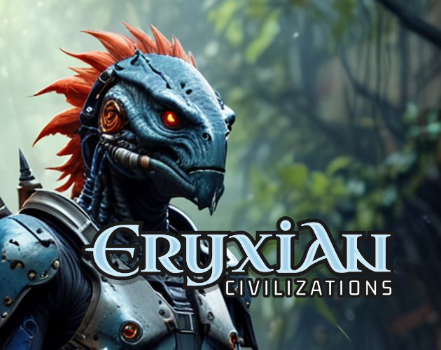

# Eryxian Civilizations Card Game


**Rules of desktop/mobile app and** Print2Play Edition differ


<table data-view="cards" data-full-width="true"><thead><tr><th></th><th></th><th></th><th data-hidden data-card-cover data-type="files"></th></tr></thead><tbody><tr><td></td><td></td><td></td><td><a href=".gitbook/assets/itch-eryxian-promo.png">itch-eryxian-promo.png</a></td></tr><tr><td></td><td></td><td></td><td><a href=".gitbook/assets/itch-eryxian-promo3.png">itch-eryxian-promo3.png</a></td></tr><tr><td></td><td></td><td></td><td><a href=".gitbook/assets/itch-eryxian-promo5.png">itch-eryxian-promo5.png</a></td></tr></tbody></table>


Erythian Civilizations is currently in closed beta


## Overview

<figure><figcaption></figcaption></figure>

Here are a couple of example overviews from products with really great docs:

> This strategic card game challenges you to build a thriving interstellar civilization, balancing exploration, diplomacy, resource management, and thrilling card-based combat. Game takes place in Eryx TCG game universe.
>
> * Game for 2+ players
> * Can be played from custom decks as CCG (Collectible Card Game) or from common deck for all players
> * Duel, Arena, and Tournament/Objectives rules
>
> — Download From the [https://eryxgames.itch.io/](https://eryxgames.itch.io/)

> Players can create their own cards using provided **ERYXIAN Rules & Lore Book**, using own graphics or provided template graphics and/or custom AI model for card generation
>
> — Download From the [https://eryxgames.itch.io/](https://eryxgames.itch.io/)

## Overview


[world-of-eryxian.md](overview/world-of-eryxian.md)



[game-features.md](overview/game-features.md)



[factions.md](overview/factions.md)


## ERYXIAN: An Another Lovecraftian Fable

On the fringe of explored space, where the tendrils of charted civilization fray into the unknown, lies the desolate planet Eryx. Scarred by the Collective conflict, humankind seek resources for a battered Earth. **Extraterrestrial Reconnaissance & Yield Xenobiology (ERYX)** project is found and sent to reestablish outposts, mining facilities and xenoarcheology sites on the planet and its two moons. But Eryx holds a sinister truth.

Here, twisted flora and fauna serve the enigmatic Eryxians, while brutal Collective's extermination units are establishing its presence on the planet. The struggle for resources once hardened humanity, but the darkness of Eryx twists their resolve. Now, they fight not just for survival, but against the insidious whispers that threaten to corrupt their very souls.

Whispers of the Ancients, cosmic horrors from beyond the stars, fuel the planet's malevolent aura. Can humanity survive this desolate crucible, or will they succumb to the madness within Eryx's ancient ruins?

<figure><figcaption></figcaption></figure>

## Rule and Lore Books


[print2play.md](rule-book/print2play.md)



[online-platforms.md](rule-book/online-platforms.md)


## Installation and Multiplayer


[getting-set-up](fundamentals/getting-set-up/)



[setting-permissions.md](fundamentals/getting-set-up/setting-permissions.md)



[inviting-members.md](fundamentals/getting-set-up/inviting-members.md)


ERYX TCG (Print2Play Edition) by Daniel Sandner is licensed under [CC BY-NC-SA 4.0\
](https://creativecommons.org/licenses/by-nc-sa/4.0/?ref=chooser-v1)
