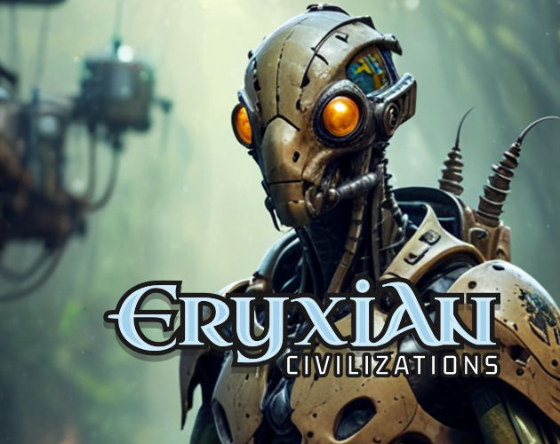

# Eryxian Civilizations Strategic Card Game and TTRPG

  

Beyond the charted stars and the familiar laws of physics lies the **Eryxian Universe** – a rich science-fantasy setting born from real astronomical wonders and fueled by boundless imagination. This repository serves as the central hub for:

*   **The Eryxian Universe Lore Wiki:** The most comprehensive and up-to-date source for the history, civilizations, technologies, mythos, and unique phenomena that define this expansive cosmos. Dive into the [**Official Eryxian Wiki here!**](https://github.com/eryxgames/eryxian/wiki)
*   🃏 **Eryxian Civilizations Card Game:** A strategic deckbuilding game where you lead a unique interstellar faction to explore, expand, exploit, and exterminate. *(Under Development)*
*   🎲 **Eryxian Universe TTRPG (Tabletop Roleplaying Game):** *(Under Development)* An upcoming TTRPG experience allowing you to forge your own legends within this vast universe.

## Primary Mission
*   To develop rich original open-source game world and flexible game system for unlimited game scenarios and various genres
---

## Eryxian Civilizations: The Card Game

Take command of a burgeoning interstellar civilization in this strategic card game for 2+ players. Balance exploration, diplomacy, resource management, and thrilling card-based combat.

*   **Gameplay:** Choose your faction, build your deck, and vie for dominance. Can be played with custom-built decks (Collectible Card Game style) or from a common deck for all players.
*   **Game Modes:** Features rules for Duels (1v1), Arena (multiplayer free-for-all), and objective-based Tournament play.
*   **Print & Play (PnP) Edition:**
    *   The PnP version allows you to print and assemble the game at home.
    *   **Download the latest PnP files and rulebook from our [itch.io page](https://eryxgames.itch.io/eryxian-civilizations) or directly from the [`/PrintAndPlay_CardGame`](./PrintAndPlay_CardGame) directory in this repository (coming soon).**
    *   Players are encouraged to create their own cards using the official **ERYXIAN Rules & Lore Book** (to be released), leveraging provided templates or custom AI for unique card generation.
*   **Digital Editions:**
    *   A [Tabletop Simulator module](link-to-your-tts-mod-if-available-else-remove-or-say-coming-soon) is available/planned for online play.
    *   A standalone digital version for desktop/mobile is in early development.
    *   :information_source: <mark style="color:blue;">Rules for digital versions may differ from the Print & Play Edition.</mark>

---

## Eryxian Universe: The TTRPG

*(Under Development)*

Embark on epic adventures across the diverse and mysterious worlds of the Eryxian Universe! The upcoming Tabletop Roleplaying Game will allow players to:

*   Create unique characters from various human factions, alien species, or even as entities within the Collective.
*   Explore uncharted star systems, ancient Architect ruins, and the enigmatic [Eryxian Labyrinths](https://github.com/eryxgames/eryxian/wiki/Eryxian-Labyrinths).
*   Engage in factional politics, corporate espionage, daring cargo runs, and confront cosmic horrors.
*   Utilize unique technologies, from modular UIT starships to the subtle powers of [Ethnosorcery](https://github.com/eryxgames/eryxian/wiki/Ethnosorcery-and-Technosorcery) and [Technosorcery](https://github.com/eryxgames/eryxian/wiki/Ethnosorcery-and-Technosorcery).

---

The TTRPG will be deeply integrated with the lore established in the [Eryxian Wiki](https://github.com/eryxgames/eryxian/wiki). Game system details, character creation rules, and adventure modules will be released in a dedicated section of this repository or a companion repository as development progresses.

  

## Delve into the Lore

The heart of the Eryxian Universe lies in its rich, interconnected lore. The **[Official Eryxian Wiki](https://github.com/eryxgames/eryxian/wiki)** is your primary portal to discover:

*   **[Eryxian World](https://github.com/eryxgames/eryxian/wiki/Eryxian-World):** The science and speculative biology of planet Eryxia, its unique trinary star system (GW Orionis), and its bizarre flora and fauna.
*   **[Eryxian Civilizations](https://github.com/eryxgames/eryxian/wiki/Eryxian-Civilizations):** Detailed profiles of Human Factions (TAM, Stellar Concord, FHC), The Collective, native Eryxians, the enigmatic Ancients, and other unique alien species.
*   **[Eryxian Technology](https://github.com/eryxgames/eryxian/wiki/Eryxian-Technology):** From FTL travel and advanced weaponry to unique energy sources and the mysterious "magic" of Ethnosorcery and Technosorcery.
*   **[Eryxian Mythos](https://github.com/eryxgames/eryxian/wiki/Eryxian-Mythos):** The ancient legends, cosmic deities (like Star Minds), and creation stories that shape the beliefs of the universe's inhabitants.
*   **[Eryxian Eras and Epochs](https://github.com/eryxgames/eryxian/wiki/Eryxian-Eras-and-Epochs):** A chronicle of cosmic time, providing context for the current state of the galaxy.
*   **[Cargo Haulers & Networks](https://github.com/eryxgames/eryxian/wiki/Cargo-Haulers-Networks):** The subculture, ships, and economic forces driving interstellar trade.
*   ...and much more, constantly expanding!

---

## Join the Community & Get Involved!

The Eryxian Universe is an ever-expanding project, and community involvement is key!

*   💬 **Discuss & Share:** Join the [Eryxian Science Talks on Telegram](https://t.me/+tiszM2PilHU3NmI0).
*   🌐 **Official Website:** Visit [eryxian.com](https://eryxian.com/) for more information and older lore archives.
*   🛠️ **Contribute:** Check out the [Get Involved](https://github.com/eryxgames/eryxian/wiki/Get-Involved) page on our Wiki for ways to contribute to the lore and game development.

---

  

## License
ERYX TCG (Print2Play Edition) by Daniel Sandner is licensed under [CC BY-NC-SA 4.0](https://creativecommons.org/licenses/by-nc-sa/4.0/?ref=chooser-v1). For commercial use contact the benevolent author.
The utilities and helper code on this repository is licensed under [MIT License](LICENSE)
